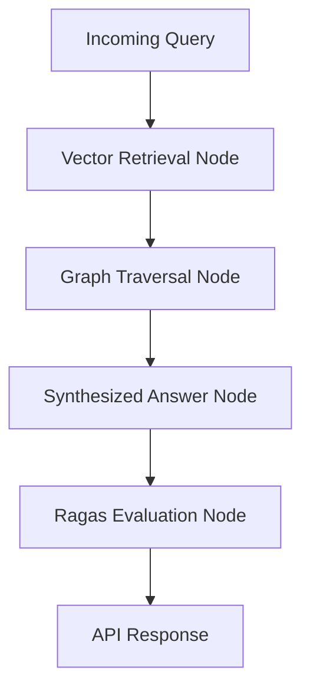

# Enterprise GraphRAG Engine 


A production-grade, state-of-the-art **Graph Retrieval-Augmented Generation (GraphRAG)** engine built with **LangGraph** and **FastAPI**. Designed for enterprise knowledge bases, this architecture combines semantic vector search with knowledge graph traversal to solve multi-hop reasoning challenges, complete with an automated evaluation loop.

---

##  System Architecture & Workflow

The application runs on a state-machine workflow orchestrated via LangGraph, ensuring strict execution boundaries and automated quality checks:



Vector Retrieval: Fetches semantically similar chunks from a vector store using dense embeddings.

Graph Traversal: Extracts related entities and relational edges to preserve context across complex documents.

Synthesis: Merges dual context streams into a grounded, comprehensive LLM generation.

Automated Evaluation: Programmatically assesses context precision and answer faithfulness using Ragas.

##  Tech Stack
Orchestration: LangGraph, LangChain

API Framework: FastAPI, Uvicorn

Evaluation: Ragas (Retrieval-Augmented Generation Assessment)

Databases: PostgreSQL (pgvector), Neo4j (Graph storage)

LLM Integration: OpenAI API / Custom LLM Gateways

##  Getting Started Locally
Prerequisites
Python 3.10 or higher
Git

##  Installation & Setup

1. **Clone the repository:**
   ```bash
   git clone github repository
   cd enterprise-graphrag-engine

##  API Usage
Once the server is running, access the interactive Swagger UI documentation at:
http://127.0.0.1:8000/docs


##  📄 License
Distributed under the MIT License. See LICENSE for more information.

